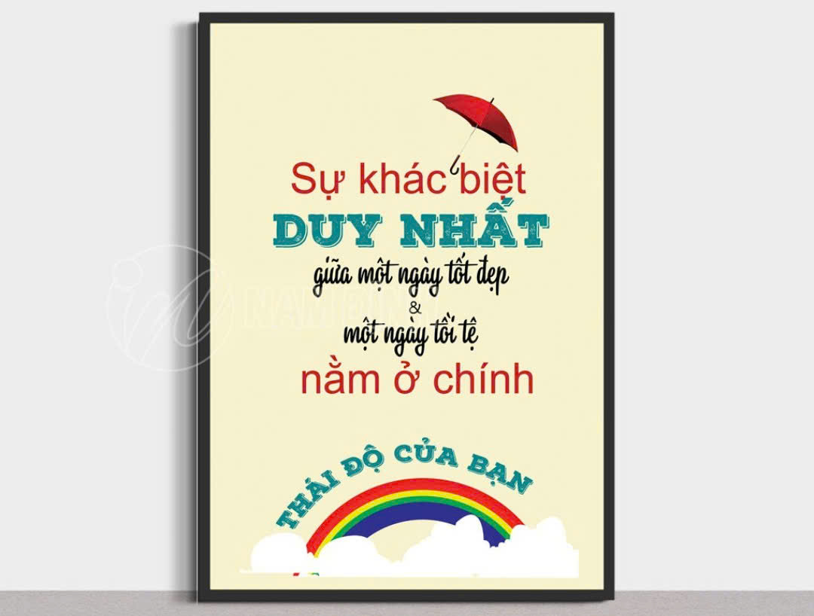

<html lang="en">
<head> 
    
</head>
<head>
    <meta charset="UTF-8">
    <meta name="viewport" content="width=device-w6s ease-in-out infinite; /* Thêm hiệu ứng chuyển động */
        }

        .banner-content p {
            font-size: 1.2rem;
            margin-top: 10px;
            font-style: italic; /* Chữ in nghiêng */
            color: #ffffff; /* Màu chữ trắng */
            animation: fadeIn 10s ease-in-out infinite; /* Thêm hiệu ứng chuyển động cho đoạn văn */
        }

        /* Hiệu ứng chuyển động cho tiêu đề */
        @keyframes slideIn {
            0% {
                transform: translateX(-100%);
                opacity: 0;
            }
            50% {
                transform: translateX(0);
                opacity: 1;
            }
            100% {
                transform: translateX(100%);
                opacity: 0;
            }
        }

        /* Hiệu ứng chuyển động cho đoạn văn */
        @keyframes fadeIn {
            0% {
                opacity: 0;
            }
            50% {
                opacity: 1;
            }
            100% {
                opacity: 0;
            }
        }
    </style>
</head>
<body>

    <!-- Pano đầu trang -->
    <header class="header-banner">
        

            <h1>Chào mừng đến với Website của nhóm 5 lớp 12 Lý</h1>
            
Nơi để chúng mình chia sẻ về bản thân

        

    </header>

</body>
</html>

<head>
    <meta charset="UTF-8">
    <meta name="viewport" content="width=device-width, initial-scale=1.0">
    <title>Chữ bên trái, Hình ảnh bên phải</title>

    
</head>
<body>

   <!-- Container chứa các phần tử chữ và hình ảnh -->
    

        <!-- Lần 1: Chữ trái, ảnh phải -->
        

            

                <h1>Chào mừng đến với trang web của chị em chúng mình</h1>
                
 Xin chào mọi người, tụi mình là nhóm 5. Nhóm tụi mình gồm 5 thành viên: Trường Giang, Hồng Ngọc, Hùng Dinh, Ngọc Thịnh, Phú Quý. Hiện tại Phú Quý đang học đội tuyển nên tạm thời 4 đứa mình sẽ cùng làm thay phần của Phú Quý

            

            

                
            

        

        <!-- Lần 2: Chữ phải, ảnh trái -->
        

            

                <h1>Slogan nhóm chúng mình</h1>
                
Chúng mình rất tâm đắc với slogan này, nó đề cao tầm quan trọng của thái độ mỗi người

            

            

                
            

        

        <!-- Lần 3: Chữ trái, ảnh phải -->
        

            

                <h1>Thành viên nhóm 5</h1>
                
Nhấn vào tên từng người để tìm hiểu kĩ hơn về người đó nhé.

            

            

                <table>
                    <tr>
                        <th>Họ và tên</th>
                    </tr>
                    <tr>
                        <td><a href="https://giangnguyen-ok.github.io/profilengocthinh.github.io/">Ngọc Thịnh</a></td>
                    </tr>
                    <tr>
                        <td><a href="https://giangnguyen-ok.github.io/profilehongngoc.github.io/">Hồng Ngọc</a></td>
                    </tr>
                    <tr>
                        <td><a href="https://giangnguyen-ok.github.io/profilephuquy.github.io/">Phú Quý</a></td>
                    </tr>
                    <tr>
                        <td><a href="https://giangnguyen-ok.github.io/profilegiang.github.io/">Trường Giang</a></td>
                    </tr>
                    <tr>
                        <td><a href="https://giangnguyen-ok.github.io/profilehungdinh.github.io/">Hùng Dinh</a></td>
                    </tr>
                </table>
            

        

        <!-- Lần 4: Chữ phải, ảnh trái -->
        

            

                <h1>Giới thiệu web học tập</h1>
                
Giới thiệu web học tập, hãy <a href="https://www.vietjack.com/">click vào đây</a>.

                
Giới thiệu link canva , hãy <a href="https://www.canva.com/design/DAGWSFUgBIc/2qh19OgTTBR9hlcWDLbu7A/edit?fbclid=IwZXh0bgNhZW0CMTEAAR12UuPckurqTYYRCniLnM98Jb9QwE0k5mXx068pr1BKQIQ34rU9iZj1vmI_aem_IJLm5NA5tlObgczUDO-n7w">click vào đây</a>.

            

            

                
            

        

    

    
Giới thiệu bản thân các bạn cho tụi mình biết với nhé hãy <a href="https://giangnguyen-ok.github.io/gioithieubanthan/">click vào đây</a>.

